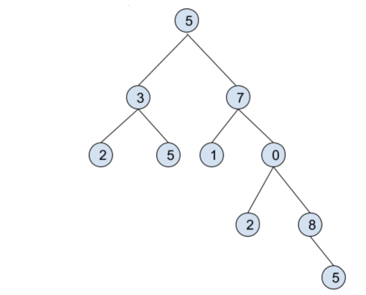
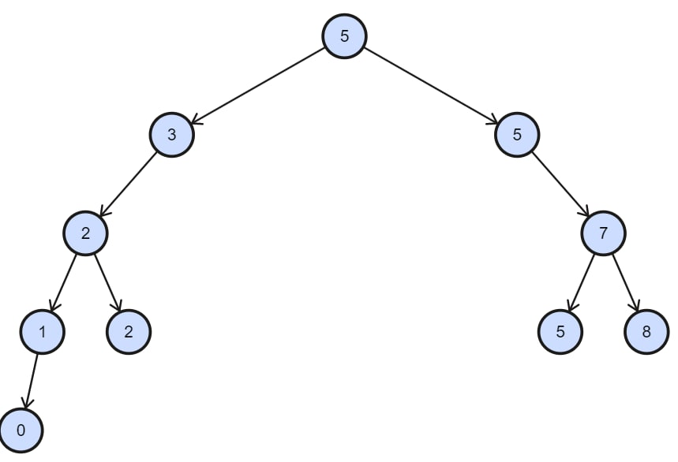

# OpenX-task
Recruitment task for OpenX Poland

## Table of contents
* [General information](#general-information)
    * [Features](#features)
    * [Tests](#tests)
* [Technologies](#technologies)
* [Project status](#project-status)
* [Contact](#contact)

## General information
This project provide the solution for the recruitment task for OpenX Poland.
This project implements a Binary Tree data structure and provides features described bellow.
Binary Tree is a data sctructure in wich ech node (parent-node) have at most two children. The first node is a root.
This implementation provide a Binary Tree in wich every rigth children is greater or equal to its parent and every left children is smaller than its parent.

### Features
| Feature desribtion               | Public method           | Private method  |
|:-------------------------------- |:-----------------------|:---------------|
| Add element to Binary Tree| void insert(int element) |Node insertNode(Node node, int element)|
| Calculate the number of nodes that do not have any children | int nodeWithoutChildren() | int withoutChildren(Node node) |
| Calculate the largest number of edges in a path from the root node to a leaf node (node without child)      | int theLongestPath() | int longestPath(Node node) |
| Check if two instances of data structures are equivalent to each other (each node, starting from the root, in both of them has the same value and children) | void isEqual(BinaryTree tree) | boolean equal(Node firstNode, Node secondNode) |
| Dispay the Binary Tree in preorder order| void displayTree() | void preOrder(Node node) |

### Tests
The project includes 3 tests (each of them uses different data to show how the methods work and verify their correctness):
1. TestForExample (.java file)
In task's example is represented the following model:

This example do not match up to the rules of implemented data structure. However elements were added to the Binary Tree manually. 

The following model represents Binary Tree corresponding to the rules described above (with the same data as in task's example):

This test compares data structures from the images above.

2. FirstTest (.java file)
In this test 3 data structures are compared.

3. SecondTest (.java file)
In this test 5 another data structures are compared.
Also there's additional method (public void readFromFile(String path)) to insert elements into Binary Tree by reading them from file.
	
## Technologies
Project is created with:
* Java: version 17
	
## Project status
Project is: complete

## Contact
Feel free to contact me!
* [Linkedin](https://www.linkedin.com/in/sasha-ishchuk/)
* E-mail: alexa.ishchuk@gmail.com
